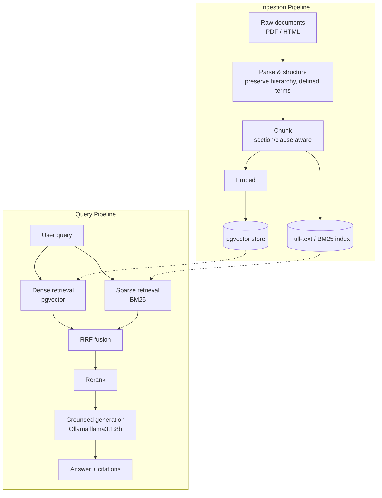

# Auto Insurance RAG — built from scratch, measured at every step

## Vision

Insurance policies are exactly the kind of document naive RAG breaks on: deeply
nested clauses, defined terms that only mean something in context, exclusions
that override exceptions to exclusions, and cross-references that span pages
or whole sections. This project builds a retrieval-augmented generation system
for auto insurance policies and consumer guides from first principles —
ingestion, hybrid retrieval, reranking, and grounded generation — with an
eval suite gating every change from day one. Nothing ships because it "looks
right"; it ships because it beats the last measured baseline.

## Architecture



## Phases

| Phase | Name | Status |
|-------|------|--------|
| v0 | Foundation — repo scaffold, tooling, corpus downloader | ✅ done |
| v1 | Ingestion — parsing, structure-aware chunking | ⬜ planned |
| v2 | Baseline retrieval — dense (pgvector) | ⬜ planned |
| v3 | Hybrid retrieval — + sparse/BM25, RRF fusion | ⬜ planned |
| v4 | Reranking | ⬜ planned |
| v5 | Grounded generation — Ollama llama3.1:8b, citations | ⬜ planned |
| v6 | Evaluation harness — golden dataset, eval-gated changes | ⬜ planned |
| v7 | Final — hardening, packaging, Docker delivery | ⬜ planned |

## Design decisions

- **pgvector over a dedicated vector DB** — one fewer moving part to operate;
  revisit only if scale or query patterns demand it.
- **Native dev + Docker delivery** — develop directly against the host for
  fast iteration; ship as Docker for reproducible deployment.
- **Ollama, `llama3.1:8b`** — local-first generation, no external API
  dependency during development.
- **Eval-gated changes** — no retrieval, chunking, or prompting change lands
  without a measured effect on the golden eval set (see `eval/`).

_(This section will grow as real tradeoffs get made in later phases.)_

## Repo layout

```
src/rag_insurance/
    ingest/       # parsing, chunking
    retrieval/    # dense + sparse retrieval, fusion, reranking
    generation/   # prompting, grounded answer generation
    eval/         # eval harness code
scripts/          # one-off / operational scripts (e.g. download_data.py)
data/raw/         # downloaded source corpus (gitignored, see .gitkeep)
eval/             # golden dataset (added in v6)
NOTES/            # phase-by-phase learning notes
```

## Getting started

```bash
uv sync
cp .env.example .env
uv run python scripts/download_data.py
```

See `PROJECT_STATE.md` for current phase status and next steps.
