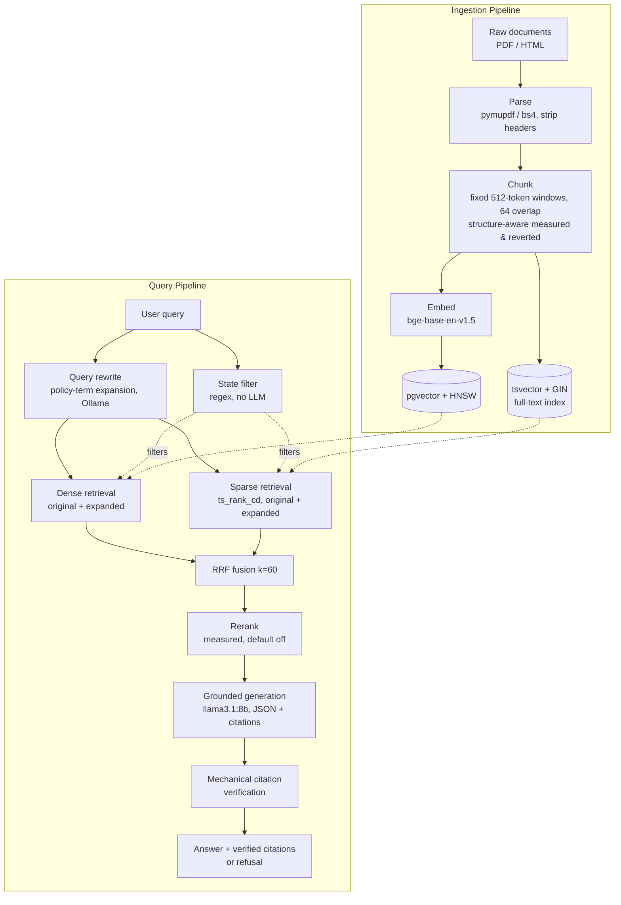
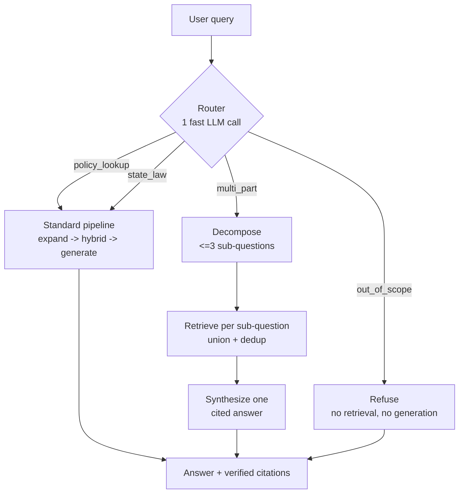

# Auto Insurance RAG — built from scratch, measured at every step

[](https://github.com/VasanthPrabahar/rag-insurance/actions/workflows/eval.yml)

A retrieval-augmented generation system for auto-insurance policies and
consumer guides, built in seven eval-gated phases. **recall@5 went 0.500 →
0.769** across measured changes on a 32-question golden set; **every emitted
citation is mechanically verified against the retrieved chunks (29/29 real
across judged runs — zero fabricated sources)**; changes that didn't beat
the previous baseline were reverted and their losing numbers kept in the
log. Built entirely with free and open-source tools, runs fully local,
zero API costs.

## Vision

Insurance policies are exactly the kind of document naive RAG breaks on: deeply
nested clauses, defined terms that only mean something in context, exclusions
that override exceptions to exclusions, and cross-references that span pages
or whole sections. This project builds RAG for that corpus from first
principles — ingestion, hybrid retrieval, grounded generation, delivery, an
agentic layer — with an eval suite gating every change from Phase 2 on.
Nothing ships because it "looks right"; it ships because it beats the last
measured baseline.

## Results ladder

Every row is a real run recorded in [eval/RESULTS.md](eval/RESULTS.md)
(full per-item JSONs in `eval/results/`). Highlights:

| milestone | recall@5 | MRR | what changed |
|-----------|----------|-----|--------------|
| v1 naive baseline (dirty corpus) | 0.500 | 0.388 | 512-token chunks, MiniLM, dense-only |
| v2 corpus rebalance | 0.577 | 0.463 | removed 60%-of-corpus rate-table noise; +labelfix |
| v3 bge embeddings | 0.769 | 0.571 | fix embedder truncation (beat chunk-shrinking A/B) |
| v3 hybrid + RRF (+HNSW) | 0.769 | 0.615 | BM25 catches exact terms dense blurs |
| v4 query expansion | 0.769 | 0.663* | conversational → policy register (*rewrite adds run noise) |
| v3 structure-chunking | 0.615 | 0.466 | **reverted** — kept for the record |
| v3/v4 cross-encoder rerank | 0.731 | 0.488 | **default off** — 512-token pair truncation |

Answer quality (full judged runs): faithfulness 0.86-0.90, correctness
0.67-0.73, with a measured judge noise floor of ~0.05 documented in
`NOTES/phase4.md` — retrieval metrics are the primary gate for a reason.

## Architecture



### Agentic layer (v6, optional engine)

The LangGraph router wraps the same pipeline — `--engine agent` on the CLI,
`engine.mode` on the API. Out-of-scope questions refuse before any
retrieval or generation; multi-part questions decompose into focused
sub-questions whose union of evidence feeds one cited answer.



## Phases

| Phase | Name | Status |
|-------|------|--------|
| v0 | Foundation — repo scaffold, tooling, corpus downloader | ✅ done |
| v1 | Naive RAG end to end — fixed-size chunks, dense-only retrieval, grounded generation (the intentionally naive baseline every later phase must beat) | ✅ done |
| v2 | Evaluation harness + corpus rebalance — golden dataset, retrieval + judge metrics, CI; changes become eval-gated from here | ✅ done |
| v3 | Retrieval upgrades — hybrid BM25/dense with RRF, bge embeddings, HNSW; structure-chunking and reranking measured and reverted (see NOTES/phase3.md) | ✅ done |
| v4 | Query rewriting (term expansion) + state filtering + mechanically verified citations with refusal | ✅ done |
| v5 | Delivery — FastAPI service (SSE streaming, startup model loading), Airflow delta-ingestion DAG, Docker delivery | ✅ done |
| v6 | Agentic layer — LCEL chain + LangGraph router (decomposition, refusal short-circuit), measured against the direct pipeline | ✅ done |
| v7 | Polish — golden-set revision, Streamlit demo, final documentation | ✅ done |

## Design decisions

- **pgvector over a dedicated vector DB** — the corpus lives next to its
  metadata, hybrid search is one SQL query away (tsvector in the same
  table), and there's one fewer system to operate. Revisit at ~10^6 vectors.
- **Framework-last** — six phases of hand-built pipeline before LangChain/
  LangGraph appeared, and when they did, they orchestrate our functions
  rather than replace them. The comparison (NOTES/phase6.md) showed the
  framework's value is routing and composition, not capability.
- **Eval-gating with reverts kept on the books** — no retrieval, chunking,
  or prompting change lands without a measured delta; losers stay in the
  results log and in the codebase behind toggles (`STRUCTURE_CHUNKING`,
  `--rerank`) so every claim is re-runnable.
- **Ollama-local everything** — generation, judging, and query expansion
  all run on a local llama3.1:8b. Zero API cost, full reproducibility, and
  the 8B constraint forced honest engineering (term expansion instead of
  fragile full rewrites; mechanical verification instead of trusting the
  model).
- **Retrieval metrics as primary gate** — deterministic; the LLM judge is
  a trend signal with a measured ~0.05 noise floor.

## Failure museum

The project's signature exhibit: things that went wrong, measured, and
what fixed them (or didn't). Details in the phase notes.

- **Fabricated citations** (Phase 2→4): the 8B model answered "what is a
  deductible" from pretraining with recall=0 — the behavior class that
  fabricates sources. Fix: structured JSON citations verified
  *mechanically* — cited ids must exist in the retrieved set; zero valid
  citations forces a refusal. 29/29 citations real across judged runs.
- **Structure-aware chunking lost** (Phase 3): splitting ISO policies on
  their real hierarchy — the "obviously right" move — regressed recall@5
  0.769 → 0.615 in two variants. Reverted; splitter kept behind a flag.
  The hypothesis it targeted had already been fixed by a better embedder.
- **Citation pressure turned the model into a quoter** (Phase 4): the
  first citation-forcing prompt collapsed multi_hop faithfulness to 0.642
  — the model pasted clauses verbatim and misapplied rules. One measured
  prompt iteration recovered it (0.800). Only the judged layer saw it.
- **The debunked agent wins** (Phase 6): the router agent "beat" the
  pipeline on judged multi_hop (faith 0.817 vs 0.700) at 5x generation
  speed — except both engines had produced near-identical answers (an
  accidental A/A test: the delta was judge noise) and the speedup was
  Ollama's prompt cache from run order. Reported as confounds, not wins.
  The agent's real win: refusing out-of-scope in ~1s instead of ~14s.
- **The judge grading a refusal as correct** (Phase 2): the LLM judge
  scored "I don't know" as correctness 1.0 against a numeric ground truth
  — why deterministic retrieval metrics are the primary gate.
- **g02, the one that got away**: "friend drives my car" still misses its
  evidence at k=5. Root cause pinned to chunk representation — the
  permissive-use clause lives in a 512-token wall of Part A text whose
  embedding is dominated by exclusions; query expansion moved it rank
  28 → 14 and no query-side fix goes further. The targeted fix
  (structure-chunk only the insuring agreements) is documented future work.

## Repo layout

```
src/rag_insurance/
    ingest/       # parsing, chunking, embedding, delta ingestion
    retrieval/    # dense + sparse, RRF, rerank, rewrite, state filter
    generation/   # grounded generation + mechanical citation verification
    agent/        # LCEL chain + LangGraph router
    api/          # FastAPI service (SSE /ask, /ingest, /health, /stats)
    eval/         # metrics, LLM judge, runner
dags/             # Airflow delta-ingestion DAG (docs-only setup)
demo/             # Streamlit chat demo + GIF storyboard
scripts/          # corpus downloader
data/raw/         # downloaded source corpus (gitignored)
eval/             # golden dataset + all eval results
NOTES/            # phase-by-phase learning notes (see NOTES/INDEX.md)
```

## Demo

```bash
uv run --group demo streamlit run demo/app.py
```

Chat UI over the API: live token streaming, citations as expandable source
boxes showing the actual chunk text, a state filter, and a pipeline/agent
engine toggle. Storyboard in `demo/DEMO_SCRIPT.md`.

## Quickstart (Docker)

Prereqs: Docker, and [Ollama](https://ollama.com) running natively on the
host with `ollama pull llama3.1:8b` (Ollama stays outside Docker for GPU
access; the container reaches it via `host.docker.internal`).

```bash
docker compose up -d --build     # pgvector + API (HF weights cached in a volume)
uv run python scripts/download_data.py   # fetch the corpus into data/raw
curl -X POST localhost:8000/ingest        # parse -> chunk -> embed -> store
curl -N -X POST localhost:8000/ask \
  -H 'Content-Type: application/json' \
  -d '{"question": "Does insurance pay if I hit a deer?"}'
```

`/ask` streams SSE: `token` events with answer text as it generates, then a
`final` event with verified citations, retrieved chunks, and a per-stage
latency breakdown (expand / retrieve / generate). Also: `GET /health`,
`GET /stats`, and `POST /ingest`.

## Local development (no Docker)

```bash
uv sync
cp .env.example .env
docker compose up -d db
uv run python scripts/download_data.py
uv run rag ingest
uv run rag ask "Is a cracked windshield collision or comprehensive?"
uv run uvicorn rag_insurance.api.app:app --reload   # the API, natively
```

## Scheduled ingestion (Airflow)

`dags/ingest_dag.py` runs delta ingestion daily: files are hash-compared
against the `ingest_files` manifest table and only new/changed documents
are re-parsed, re-embedded, and upserted. Airflow is intentionally not in
the core dependencies or compose file (see `NOTES/phase5.md`); the DAG
header documents the `airflow standalone` setup, and the same delta logic
is importable without Airflow (`rag_insurance.ingest.delta`).

## Limitations & future work

- **g02 is still unsolved** — the permissive-use clause needs targeted
  structure-chunking of the ISO insuring agreements (the general version
  of that idea measurably failed; the targeted version is the top item).
- **Reranking is off** — cross-encoder/ms-marco truncates 512-token pairs;
  a longer-context reranker (bge-reranker-base) should retire that
  pathology and be re-measured.
- **The judge is weak** — same 8B model that generates, ~0.05 noise floor,
  demonstrated grading errors; a larger judge model would sharpen every
  quality claim above.
- **Router/golden-set coupling** — the agent's router encodes labeling
  judgments in its prompt (it still refuses the relabeled g27); routing
  prompts need to evolve with the eval set.
- **Corpus scale** — 15 documents, 174 chunks: HNSW is pedagogical, exact
  scan would do, and every latency number reflects a single-user local
  deployment.

Everything above runs on free and open-source tools, fully local, with
zero API costs: pgvector, sentence-transformers, Ollama, FastAPI,
LangGraph, Streamlit.

See `PROJECT_STATE.md` for the full phase-by-phase record.
