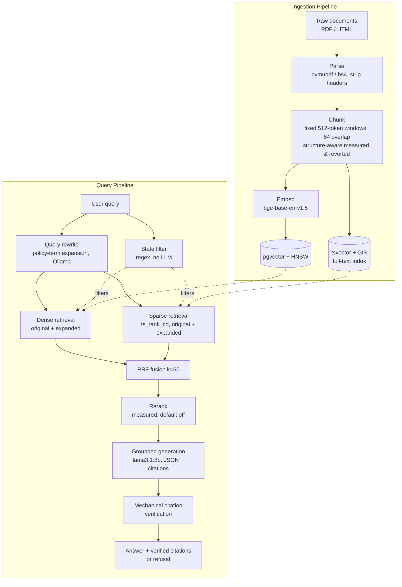

# Auto Insurance RAG — built from scratch, measured at every step

[](https://github.com/VasanthPrabahar/rag-insurance/actions/workflows/eval.yml)

## Vision

Insurance policies are exactly the kind of document naive RAG breaks on: deeply
nested clauses, defined terms that only mean something in context, exclusions
that override exceptions to exclusions, and cross-references that span pages
or whole sections. This project builds a retrieval-augmented generation system
for auto insurance policies and consumer guides from first principles —
ingestion, hybrid retrieval, reranking, and grounded generation — with an
eval suite gating every change from day one. Nothing ships because it "looks
right"; it ships because it beats the last measured baseline.

## Architecture



## Phases

| Phase | Name | Status |
|-------|------|--------|
| v0 | Foundation — repo scaffold, tooling, corpus downloader | ✅ done |
| v1 | Naive RAG end to end — fixed-size chunks, dense-only retrieval, grounded generation (the intentionally naive baseline every later phase must beat) | ✅ done |
| v2 | Evaluation harness + corpus rebalance — golden dataset, retrieval + judge metrics, CI; changes become eval-gated from here | ✅ done |
| v3 | Retrieval upgrades — hybrid BM25/dense with RRF, bge embeddings, HNSW; structure-chunking and reranking measured and reverted (see NOTES/phase3.md) | ✅ done |
| v4 | Query rewriting (term expansion) + state filtering + mechanically verified citations with refusal | ✅ done |
| v5 | Delivery — FastAPI service, Airflow ingestion DAG, full Docker delivery | ⬜ planned |
| v6 | Agentic layer — LangChain/LangGraph router + query decomposition, with honest latency comparison | ⬜ planned |
| v7 | Polish — demo UI, final README | ⬜ planned |

## Design decisions

- **pgvector over a dedicated vector DB** — one fewer moving part to operate;
  revisit only if scale or query patterns demand it.
- **Native dev + Docker delivery** — develop directly against the host for
  fast iteration; ship as Docker for reproducible deployment.
- **Ollama, `llama3.1:8b`** — local-first generation, no external API
  dependency during development.
- **Eval-gated changes** — no retrieval, chunking, or prompting change lands
  without a measured effect on the golden eval set (see `eval/`).

_(This section will grow as real tradeoffs get made in later phases.)_

## Repo layout

```
src/rag_insurance/
    ingest/       # parsing, chunking
    retrieval/    # dense + sparse retrieval, fusion, reranking
    generation/   # prompting, grounded answer generation
    eval/         # eval harness code (metrics, LLM judge)
scripts/          # one-off / operational scripts (e.g. download_data.py)
data/raw/         # downloaded source corpus (gitignored, see .gitkeep)
eval/             # golden dataset + eval results (added in v2)
NOTES/            # phase-by-phase learning notes
```

## Getting started

```bash
uv sync
cp .env.example .env
uv run python scripts/download_data.py
```

See `PROJECT_STATE.md` for current phase status and next steps.
